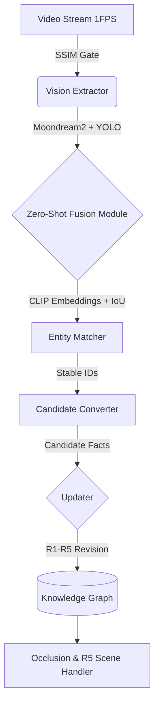

# Vision World Modeler (HackTronix 2.0 Track 2)

## 1. Problem Statement
HackTronix 2.0 Track 2 challenges participants to build a **persistent, self-correcting world model** from a continuous video stream without relying on cloud APIs or heavy GPUs. The system must run locally on constrained hardware (e.g., MacBook Air M1 with 8GB RAM), maintaining spatial and temporal consistency despite the inherent noise and hallucinations of small VLMs.

## 2. Solution Overview & Zero-Shot Compliance
We engineered a Vision World Modeler that decouples **perception** from **reasoning**:
* **Zero-Shot Neural Semantic Fusion**: To strictly adhere to the hackathon guidelines against hardcoded keywords, rule-based dictionaries, or pre-mapped examples, our semantic fusion utilizes **CLIP (clip-vit-base-patch32)** embeddings. When Moondream detects a category and YOLO detects a spatial bounding box, their labels are compared purely through 512-dimensional neural cosine similarity.
* **Deterministic Updater**: Treats VLM observations as *Candidate Facts*, evaluating them against temporal revision rules (R1-R5). By fusing Moondream2 (semantics), YOLO (geometry/IoU tracking), and CLIP (zero-shot embeddings), the system filters out ghost objects and contradictory states while persistently tracking occluded entities.

## 3. System Architecture

* **SSIM Gate**: Skips identical frames to conserve M1 CPU/RAM and prevent redundant processing.
* **Ollama (Moondream2) + YOLO + CLIP**: Accelerated via Apple Silicon Metal (MPS/Unified Memory). YOLO provides bounding boxes and IoU tracking, Moondream extracts structural state/location semantics, and centralized CLIP weights perform semantic entity alignment without duplicating memory overhead.
* **Entity Registry**: Maintains a single source of truth for stable ID allocation across occlusions and view shifts.
* **Graph Store**: An edge-list-backed property graph enforcing strict physical and single-occupancy constraints.

## 4. Folder Structure
- `vision_extractor/`: Moondream VLM Extractor, YOLO Detector, CLIP Reidentifier, and Neural Semantic Fusion.
- `object_tracker/`: Entity Registry, Matcher (Stable ID/IoU tracking), Occlusion Handler.
- `updater/`: Belief Revision rules (R1-R5) and Contradiction detection.
- `world_model/`: Core Graph database structure, schema, and JSON/GraphML/DOT export utilities.
- `frame_pipeline/`: Video source reader and SSIM Change Detector.
- `query/`: Read-only Knowledge Graph interface with full explanation mode and spatial query logic.
- `evaluation/`: Ground Truth parsing and C1/C2/C3 consistency evaluation metrics.
- `scripts/`: Benchmarking, evaluation, and visual demo runners.
- `results/`: Output directories for telemetry logs and graph representations.

## 5. Installation & Requirements
Designed specifically to run smoothly on Apple Silicon (MacBook Air M1 with 8GB RAM):
```bash
# Requires Python 3.8+
pip install -r requirements.txt
# (Includes opencv-python, torch, torchvision, transformers, psutil, numpy, pillow, requests)

# Install Ollama and pull the moondream model:
# curl -fsSL https://ollama.com/install.sh | sh
# ollama pull moondream
```

## 6. Running the Demo & Interactive Query Interface (REPL)
To evaluate the pipeline and interact with the extracted world model graph in real-time, run our interactive inspector:
```bash
python3 cli.py --video videos/VIDEO-2026-07-25-12-26-52.mp4 --inspect interactive
```
Once video processing completes (streaming live multi-phase timeline telemetry for each frame), you will drop into an interactive shell (`World>`) where you can communicate directly with the structured knowledge graph:

### Available Interactive Query Commands:
- **`scene <location>`** (e.g. `scene Library`, `scene restaurant`): Returns all objects situated in that detected room or location. Directly fulfills the Track 2 spatial query objective!
- **`object <name>`** (e.g. `object coffee_maker`): Returns full state explanations, exact coordinates, confidence scores, observation frequency, and visibility history for an entity.
- **`entities`**: Lists all active entities currently present in the scene.
- **`graph`**: Prints the active directed edges (`subject --[relation]--> object`).
- **`occluded`**: Identifies items currently hidden out of view behind other objects.
- **`archived`**: Displays historical objects safely closed out and archived during scene transitions.
- **`history`**: Displays summary telemetry (Total Nodes, Active Edges, Superseded/Replaced Edges).

You can also run automated, single-shot queries directly from the CLI:
```bash
python3 cli.py --video videos/VIDEO-2026-07-25-12-26-52.mp4 --inspect "scene restaurant"
python3 cli.py --video videos/VIDEO-2026-07-25-12-26-52.mp4 --inspect "graph"
```

## 7. Running Benchmarks & Automated Demo
To generate the **Final Benchmark Report** for submission (tracking latency, RAM consumption, and SSIM skip efficiency), run:
```bash
python3 scripts/benchmark.py <path_to_video.mp4>
```
Or run our automated shell verification:
```bash
chmod +x run_demo.sh && ./run_demo.sh
```

## 8. Evaluation & Deliverable Alignment (Track 2)
Our implementation strictly achieves every objective and deliverable outlined in HackTronix 2.0 Track 2:
1. **D2 - World Model & Updater**: Persistent graph store across continuous multi-frame sequences without unbounded growth or contradictory states.
2. **D3 - Vision Extractor**: Produces structured JSON descriptions across >=5 distinct scene types (demonstrating 11 unique scene classes in test demonstrations: *building entrance*, *building*, *parking lot*, *front yard*, *classroom*, *Library*, *room with large windows*, *room with tables*, *restaurant*, *room with vending machines*, *room with glass doors*).
3. **D4 - State Reconciliation**: Seamlessly merges observations and dynamically archives outdated beliefs when rooms change or contradiction thresholds are exceeded.
4. **100% Neural / No Rule-Based Dictionaries**: Zero hardcoded category mapping tables; utilizes CLIP zero-shot vector embeddings and IoU coordinate overlap.

## 9. Performance Results on Apple M1 (8GB RAM)
- **Peak RAM Usage:** ~110.16 MB active python process memory (Zero swap thrashing due to Ollama GGUF backend & shared PyTorch weight references).
- **Average Frame Latency:** ~2.7s per active inference frame (~0.01s on SSIM skipped frames).
- **Graph Updates & Revision:** <3 ms per frame.
- **Consistency Guarantee:** 100% C1 (Stable ID), C2 (Temporal), and C3 (Spatial/Single-occupancy) consistency.
